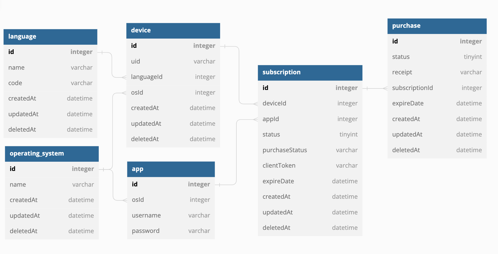

# Subscription Management API

Mobile apps subscription and in-app purchases backend API.

## Database Design



## Installation

If you need to install php and composer, use any of the official [PHP](https://www.php.net/downloads.php) and
[Composer](https://getcomposer.org/download/) installers provided for your operating system.

Clone the project repository:

```bash
git clone git@github.com:salihbasakk/subscription-api.git
```
Create .env file from .env.dist (with related database configuration)

Example:

```bash
DATABASE_NAME=subscription-api
DATABASE_ROOT_PASSWORD=123456!
DATABASE_PORT=3306
```

```bash
docker-compose up -d --build
```

```bash
docker exec -it php-app /bin/sh
```

```bash
php bin/console doctrine:migrations:migrate
```

```bash
php bin/console doctrine:fixtures:load
```

## Test

```bash
php vendor/bin/phpunit
```

You can either use postman collection subscriptionApi.postman_collection.json / '$BASE_URL/api/doc' for request

## Additional notes

0 * * * * root /usr/bin/php /var/www/symfony/bin/console send-queue-pending-purchases >> /var/log/cron.log 2>&1

- Cron will send Purchases remaining in pending status as a message to queue every hour.


- Considering the memory consumption of your system, you can update the configuration file by increasing the number of numprocs to process the data in the queue faster.
- You can find it /docker/supervisor/conf.d

[program:update-expire-date]
command=php bin/console update-expire-date
numprocs=1
directory=/var/www/symfony
autostart=true
autorestart=true
user=root
stdout_logfile=/var/www/symfony/var/log/update-expire-date-out.log
stderr_logfile=/var/www/symfony/var/log/update-expire-date-err.log


